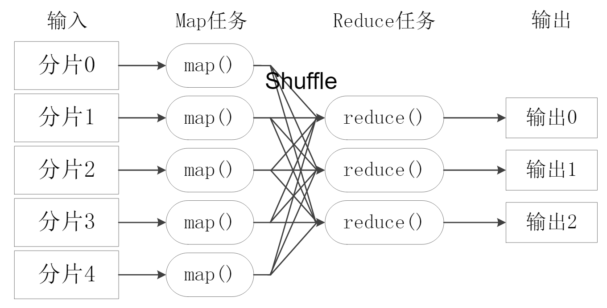
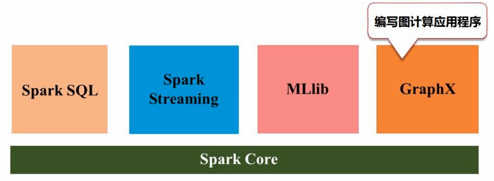

# 大数据概述

1. 分布式计算带来算力量
2. 存储、网络的升级
3. 信息产生的变更

- 具有规范的行列结构的数据称为结构化数据，其余为非结构化数据
- 处理大数据要足够快
- 打数据的价值密度低，单点价值高，如摄像头数据

1. 全部而非抽样，算力带来的提升
2. 效率而非精确，系统要求实时性
3. 相关而非因果，相关性而不是追求为什么

数据隐私与安全贯穿了：数据采集、数据存储和管理、数据处理和分析。重点是：**数据存储管理、数据处理与分析**，归为两个核心：分布式存储和分布式处理，也就是集群。

- 分布式存储：`GFS`分布式文件系统，`HDFS`开源实现的分布式文件系统，`BigTable, HBase, NoSql, NewSQL`等等等等。
- 分布式处理：`mapreduce, spark, flink`等，集群加速计算

## 大数据计算模式

不同的场景需求下需要不同的计算模式。

- 批处理，一次性处理大量数据，如 mapreduce，spark
- 流计算，需要实时处理，给出实时响应，否则结果失去价值，如 Flink
- 图计算，地理信息、交通网络、社交网络等，如 pregel，graphx
- 查询分析计算，类似的 SQL 查询计算，如 Dremel，Hive 等

## hadoop

不是单一的软件，是完整的生态系统。

- **HDFS**，应用广泛，如非结构化数据的存储，支持海量分布式文件存储
- YARN，分配CPU和内存等资源
- **MapReduce**，分布式计算
- Hive，存储数据与分析，如SQL。不存储数据，数据在HDFS，Hive只是编程接口，将SQL语句换成mapreduce计算语句，对HDFS存储的数据进行查询分析，返回结果
- Pig，数据流处理，清洗、转换和加载，和 Hive 组合使用，Hive查询数据时，Pig完成对数据的清洗
- Mahout，分布式数据挖掘机器学习常见算法等
- Ambari，自动安装、部署和配置集群
- zookeeper，如选择 master 节点等
- HBase，实时计算
- Sqoop，数据库抽取、转换、加载，将历史存储的关系性数据保存到HDFS中，进行大数据处理。将HDFS中的数据保存到SQL等关系性数据库中。

### mapreduce

分布式计算，像写单击程序一样写分布式程序，屏蔽了底层细节。

### YARN

Yet Another Resource Negotiator。企业中，不同的需求用不同的计算框架，将三种框架部署到1000台机器中，会产生资源争抢问题。有一个统一的资源调度管理框架，防止资源浪费、和资源竞争，方便数据无缝使用，YARN产生了。

## Spark

不是单一产品，是完备的生态系统。底层的核心组件是 Spark Core，满足批处理的需求。在之上，开发满足其他需求的组件。

与 hadoop 的对比

- hadoop 的 mapreduce 表达能力差
- 使用 mapreduce 反复迭代，每次迭代都需要读入和写出到磁盘，IO开销大
- 延迟高，任务衔接慢，只有一个 map 没做完，全部的 reduce 就不能开始

spark 计算模式本质是 mapreduce，也提供了其他操作。可以将计算结果放入内存，迭代计算效率较高。Spark 是单纯的计算框架，不具备存储能力。所以不会取代 hadoop，而是取代其中的计算框架 mapreduce，继续使用 hadoop 中的 HDFS。

## Flink

也是计算框架，擅长处理流数据。