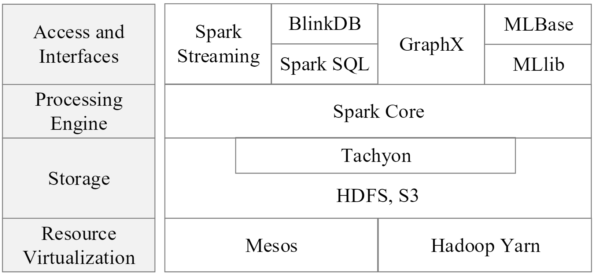
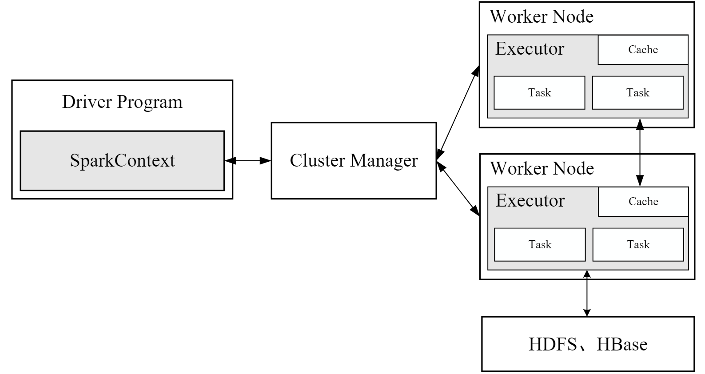
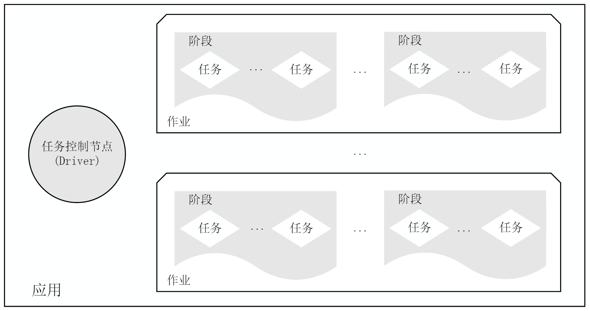
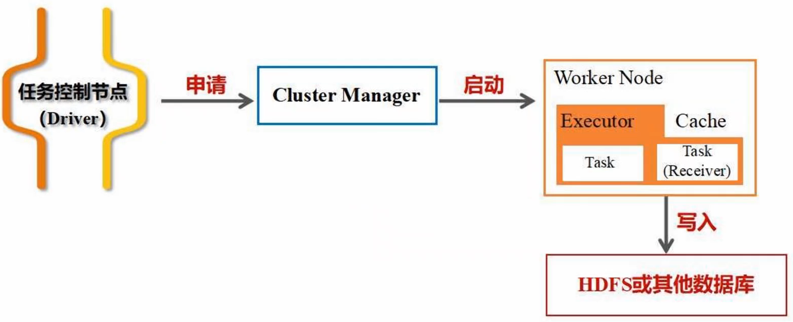
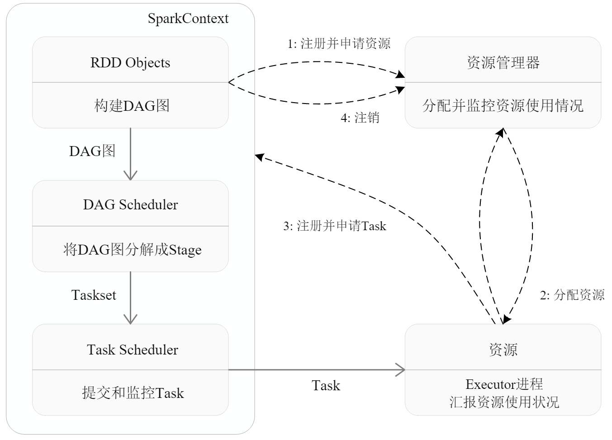
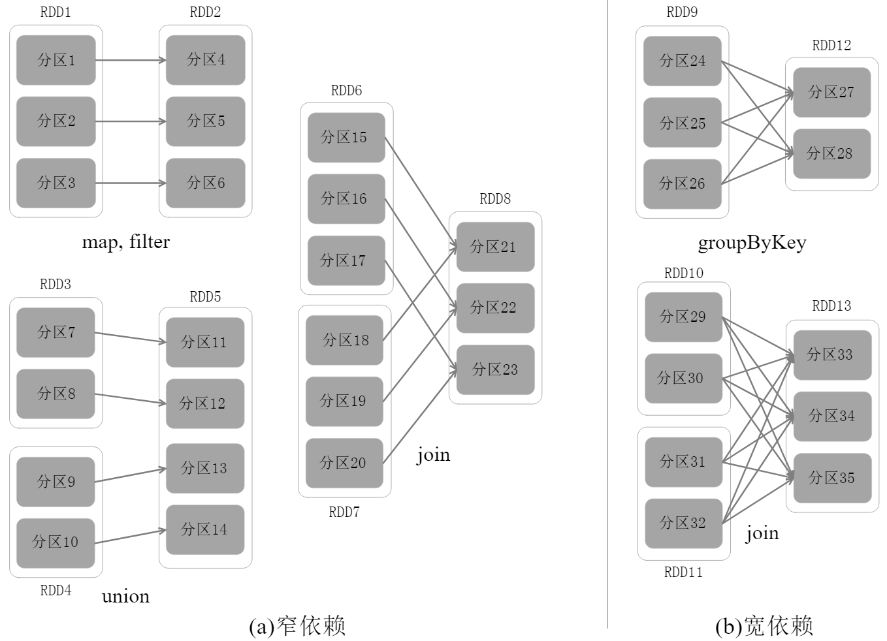
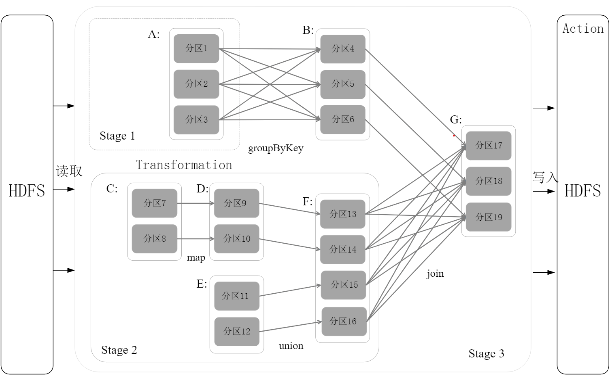
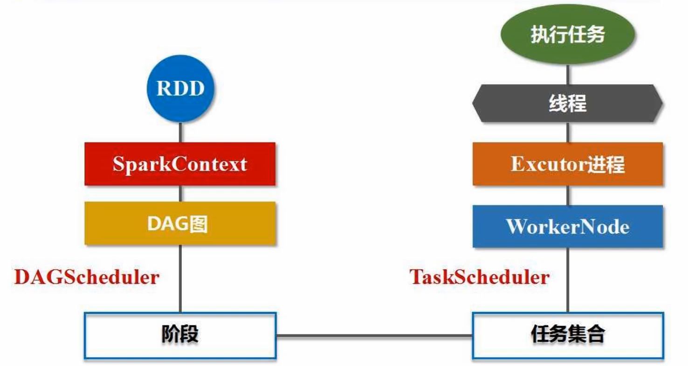

# Spark 概述

基于内存的计算框架，所以运行速度快。DAG（有向无环图）的执行引擎，对整个执行过程进行优化，实现流水化作业，而不是写入内存。

- spark shell 进行交互式编程
- 完成企业的各种需求，流计算，SQL查询，图计算等
- 可以用独立的机器运行，也支持云端的集群
- 可以访问很多的数据源，HDFS，HBase，Hive等，从这里读取数据
- 多种计算操作，表达能力强
- 可以尽力在内存计算，IO消耗低，迭代计算高
- DAG的任务调度机制，进行优化

# Spark 生态系统

满足不同应用的场景需求，可以借助 YARN，作为资源调度和管理的管家。满足一站式软件需求。使用多种框架时，需要对数据格式进行转换。

- 复杂的批量数据处理，十几分钟
- 基于历史数据的交互查询。如过去一个月内产品销量，在这个销量中查询地区，十几秒内
- 实时数据流的处理，秒级响应，如商品推荐

- 底层是资源管理器
- HDFS基于磁盘的分布式文件系统，S3云端的存储服务，Tachyon基于内存的分布式文件系统
- Spark core：满足批处理需求。

# Spark 基本概念和架构设计

典型的主从架构：

- cluster manager：集群资源管理器，如 YARN。编程不指定的话会用自己的资源管理器。

## RDD

Resilient Distributed Datasets，分布式内存的抽象概念，提供一种高度受限的共享内存模型。弹性：数据少，存储在一台机子的内存中；数据多，数据会被分区，存储在多台机子的内存中，分区数目动态可变。是 Spark 最核心的数据抽象。

## DAG

反映 RDD 之间的依赖关系，反映编程时对 RDD 的变换操作，操作会连接成一张图。

## Executor

运行在工作节点的进程，负责执行任务。每个工作节点运行一个 Executor 的进程，一个进程有很多线程，每个线程去执行相关的任务。

## Application

用户编写的 Spark 应用程序。

## Task

运行在 Executor 进程上的任务单元，一个工作节点可能有多个任务。

## Job

一个 job 包含多个 RDD 及作用于相应 RDD 上的各种操作。一个应用程序被分解为多个作业去完成。

## Stage

是 job 的基本调度单位，一个 job 分解多个小 job，小 job 被分解为多组 task，每组 task 称为 stage。

执行应用时，主节点向资源管理器申请资源，启动 executor 进程，向 executor 发送代码和文件。应用程序在 Executor 上派发出线程，线程执行完毕后，返回结果给主进程或者写入 HDFS。

# 基本运行流程

1. 为应用构建基本的运行环境，分配 driver 节点，节点创建 SparkContext 对象，负责任务调度、恢复、汇总等。
2. SparkContext 向资源管理器申请资源，进行任务分配。
3. worker node 上面的 executor 进程启动，派生线程去执行任务。
4. SparkContext 根据 RDD 的依赖关系，生成有向无环图 DAG，交给 DAG Schedular 将 DAG 分解为多个 stage，每个阶段都是任务的集合。
5. 任务的分发：线程会向 driver 节点申请任务。主节点将任务集合提交给 Task Scheduler 的组件，将之前生成的每个阶段的任务分发给不同的节点去处理。
6. 计算向数据去靠拢，数据位于哪里，就分配哪个机器去计算。
7. 结果执行完毕后，反馈给 Task Scheduler，在返回给 DAG Schedular，在返回给 SparkContext，写入数据，释放资源。

# RDD 运行原理

避免：反复的读写会造成磁盘开销、序列化（内存中的对象转成适合存储和传输的格式，如二进制）与反序列化开销。

RDD 就是分布式对象的集合，是一个只读的分区记录集合。提供抽象的数据结构，不必关心底层分布式的数据特性，将处理转换为一系列逻辑操作。不管多复杂的任务，都可以通过 RDD 操作完成。

不同 RDD 的操作依赖形成有向无环图 DAG，可以进行优化。实现数据的管道化处理，一个操作结束后，不需要到磁盘，可以扔给另一个操作作为输入。

一个 RDD 可能很大，如几十 GB，此时要分区，分布式的保存到很多机器内存中。每个分区是不同的数据片段，放在不同的机器，就可以高效的并行计算。

RDD 提供高度受限的共享内存模型，只读，不能修改。一个 RDD 转换为另一个 RDD 的过程当中可以修改，转换可以通过调用 Spark 提供的 API 实现。

RDD 操作只支持粗粒度修改，不适合细粒度操作，一次只能针对 RDD 全集进行转换。不能像数据库那样对单条数据进行修改。但能力强大，表达不受限。操作分为动作类型操作和转换类型操作。

## 典型执行过程

惰性机制：转换不会进行实际操作，只会记录转换的轨迹，表明需要进行这样的转换，但不真正的执行。遇到动作类型，才会触发从头到尾的计算。

1. 读取外部数据，创建 RDD
2. 进行一系列转换操作，不计算
3. 然后动作类型操作，计算得到结果

## 管道化处理

每次转换过程形成一个管道流，不用将数据落地到磁盘。一个操作的输出直接作为另一个操作的输入，在多个 RDD 之间传递。

## 高效计算

1. 天然的容错性，非数据备份、日志回滚等开销较大的方式，而是借助 RDD 的依赖关系重新生成数据，甚至不用生成实际的数据，而是重新生成依赖关系。
2. 中间结果可以持久化保存到内存，而不是保存到磁盘。数据在内存的多个 RDD 之间进行传递，避免磁盘的 IO 开销与序列化开销。

# RDD 依赖关系

1. shuffle 操作：数据的交互与分发
2. 宽依赖，包含 shuffle 操作，一个父亲的一个分区对应一个子 RDD 的多个分区，必须要落到磁盘。
3. 窄依赖，一个子 RDD 分区对应一个或多个父 RDD 的分区

Spark 优化原理：fork 和 join。一个 RDD 到另一个 RDD，先一个 fork 并行执行，然后一个 join 合并结果。当有多个 RDD 时，会有很多 fork 和 join。可以取消中间多余的 join 来优化程序，实现管道化处理。

一个应用被分为多个作业，一个作业被分为多个阶段，一个阶段是多个子任务的集合。一个作业分为多个阶段的原因与拆分阶段的依据：

1. 宽依赖，不能进行流水线优化，发生了 shuffle，划分为两个阶段
2. 窄依赖，可以进行流水线优化，不用拆分阶段

切分阶段：DAG 有向无环图作为输入，窄依赖就管道化处理；宽依赖就切分为两个阶段。

- A 到 B 发生了 shuffle，分为第一个阶段
- C D E F 都是窄依赖，实现并行化的流水线管道处理，是第二个阶段
- B F 到 G 需求切分为两个阶段，是第三个阶段

- 每个阶段包含若干任务
- 每个任务给 Task Scheduler，将任务分给 Executor 进程，线程执行任务

# Spark 部署方式

支持单机和集群部署。集群部署有三种模式：

1. standalone，使用集群自带的资源管理器来管理资源，性能不好
2. mesos，使用 mesos 作为资源管理器，性能好
3. YARN，较为通用

hadoop 和 spark 不是对等的框架。hadoop 的分布式数据库 HBase 和分布式文件管理系统 HDFS 等存储框架仍然会保留。