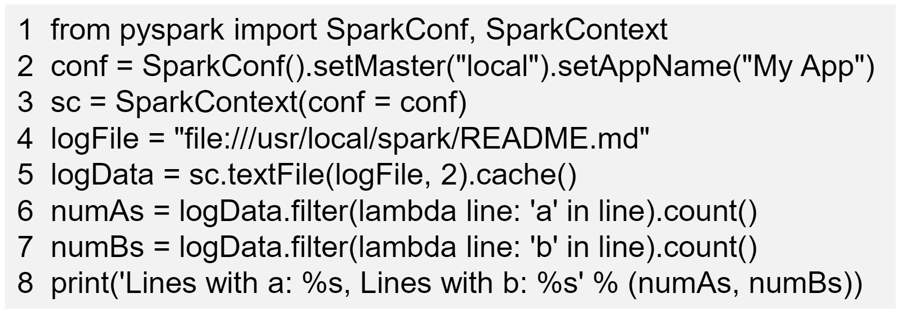

# Spark 安装

和其他组件一起工作，最终编译为 java 的字节码去运行。所以需要 java、hadoop 等环境。

`usr`：unix software resource

若使用 HDFS 中的文件，需要提前启动 hadoop。

只有一台笔记本电脑，hadoop 是伪分布式：将 name node 和 data node 放到一台计算机上，实际上应该是一个 name node，多个 data node。

Spark 部署成 `local` 是单机模式，可以和 hadoop 伪分布式进行交互，可以访问 HDFS 的文件。集群部署不在是和伪分布式进行交互。

# pyspark

是一个交互式的执行环境，不是 spark shell，这个是给 scala 准备的。

1. `pyspark --master <master-url>`进入交互式环境，可以选择进入 local、YARN、standlone 模式
   1. local，一个 worker 线程去本地化执行 Spark，完全不并行
   2. local[*]，使用逻辑 CPU 个数数量的线程来本地运行 Spark，逻辑 CPU 个数，物理 CPU 的个数乘以 CPU 的核数
   3. local[K]，使用 K 个 worker 线程本地运行 Spark
   4. spark://HOST:port，进入集群模式，使用 standalone 管理模式，默认 port 是 7077
   5. mesos://HOST:port，连接到指定的 mesos 集群，默认端口是 5050
   6. yarn-client，集群模式，YARN 作为资源管理器，driver 节点是当前机器，当前节点得一直开着，调试程序用
   7. yarn-cluster，集群模式，YARN 作为资源管理器，driver 节点在集群的某个电脑中，发布程序用
   8. yarn，默认是 yarn-client 模式
   9. 没参数，默认为 local[*] 模式
2. `--jars`，把相关的 jar 包添加到 classpath 中，多个 jar 包，用逗号分割
3. `--help`，获取参数及含义

# spark-submit



1. 生成配置的上下文信息：`setMaster("local").setAppName("First APP")`，网页查看管理的时候，能看到名称
2. 本地文件：`file:///`格式
3. `sc.textFile` 生成的RDD 有很多元素，每个元素是一行文本

## 执行

1. `python word.py`
2. 
    ```py
    spark-submit # 提交到 spark 中运行
        --master <master-url>
        --deploy-mode <deploy-mode> # 部署模式
        filename.py
        [arguments] # 传递给文件的参数
    spark-submit --help
    ```

会打印很多中间信息，但只想打印最后结果。修改 log4j 的日志信息，找到日志的配置文件，改为：
```log
log4j.rootCategory=ERROR, console
```

# 集群环境搭建

假设此时有三台机器，一个 master，两个 slaver。且已经构建好了 hadoop 环境。Spark 中的 worker 节点和 hadoop 中的 data node 节点放在同一台机器上，减少数据 IO。

在 master 节点上安装 Spark，选择提供 hadoop 版本的一个。配置环境变量后，去配置 slaves 文件，告诉主节点从节点是哪些，局域网内部，按照主机名能找到机器。
```spark
slave01 # 主机名
slave02
```

在 master 主机上打开浏览器，访问 `https://master:8080`，查看集群信息。

先关闭 master 节点，在关闭 worker 节点，在关闭 hadoop 集群。