# RDD 创建

在 Spark core 核心上开发了其他组件，RDD 编程是在 Spark core 上进行的操作。可以通过从文件系统加载数据、集合数据创建 RDD。

1. 从文件系统加载数据创建 RDD，通过 SparkContext 的 `textFile()` 方法读取数据生成**内存中的 RDD**。支持加载的数据类型为：本地文件系统的文件，分布式文件系统 HDFS 中的文件，S3 存储的云文件等。pyshark 交互式环境会生成默认的 sparkcontext，写代码需要自己生成。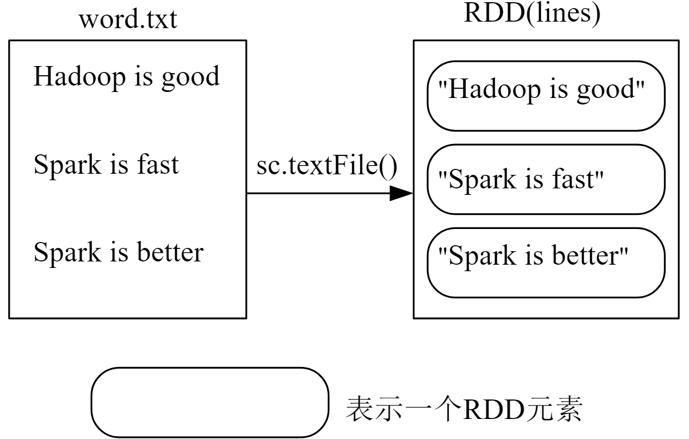 RDD 中的元素也是字符串，然后 `rdd.foreach(print)`，对 RDD 中的每个元素执行 print 函数。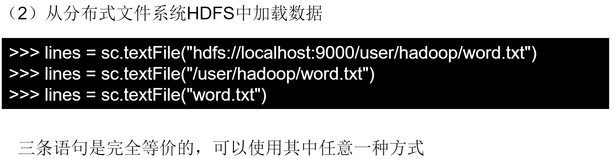
2. parallelize 方法，对集合或列表并行化来创建 RDD。
    ```py
    ls = [1, 2, 3, 4, 5]
    rdd = sc.parallelize(ls)
    rdd.foreach(print)
    ```
    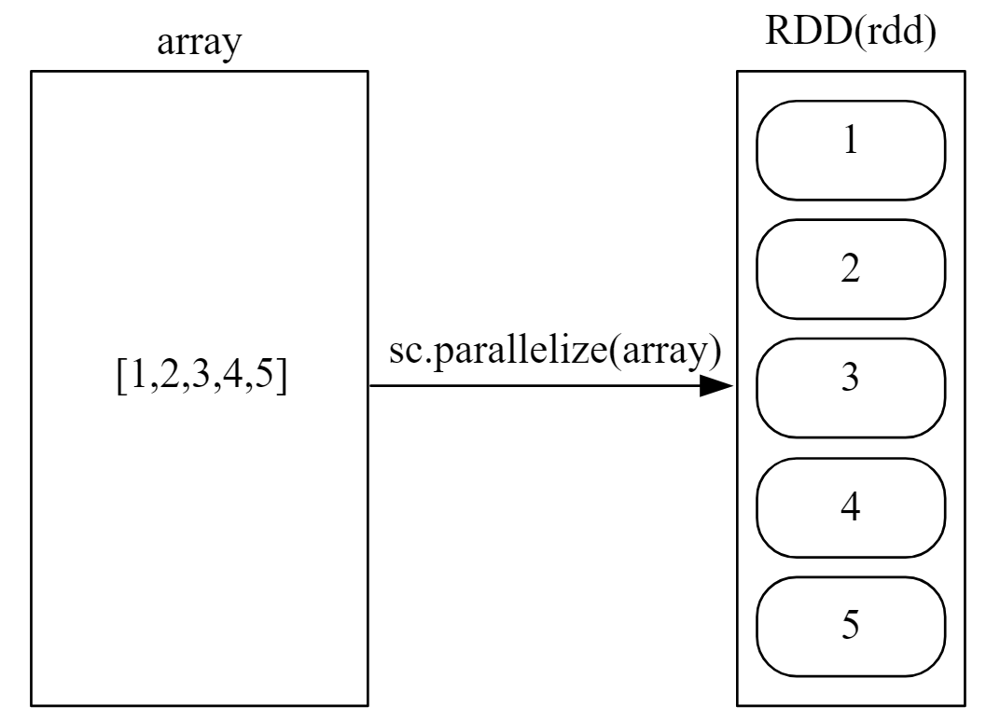

# RDD 转换操作

RDD 创建之后不可修改，每次转换操作会生成新的 RDD，多次的转换操作会生成 DAG 图。而后提交 DAG 转换图，进行优化，stage，子任务，到 worker 节点。转换不会发生计算，只记录转换的轨迹，这是惰性机制。遇到行动类型的操作，才会发生计算。

- filter(func)：筛选出满足 func 要求的元素，结果返回一个新数据集。`lambda line: "s" in line`，前者是函数的输入参数，后者是函数体。包含，为 true 放到输出结果。遍历 RDD 中的每一个元素，执行 func 函数。

- map(func)：一对一映射，每个元素传入 func 函数，结果返回一个新数据集。遍历 RDD 中的每一个元素，执行 func 函数。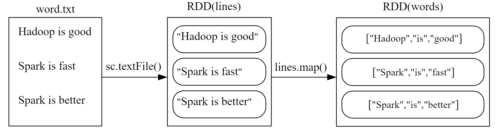

- flatmap(func)：输入元素可以被映射为0个或多个元素。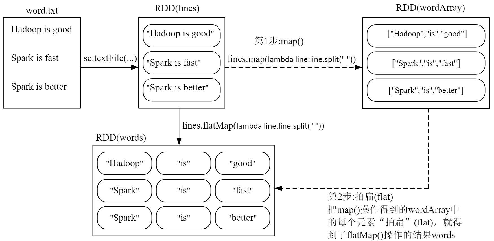

- groupByKey()：应用于键值对数据集，按键分组，值是一个列表。是一个可迭代的对象。rdd = [('a', 1), ..., ('a', 2)]。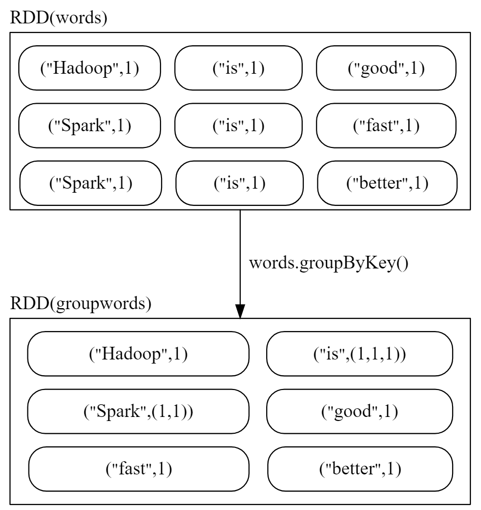

- reduceByKey(func)：应用于键值对数据集，两部操作，先按照上面的内容生成归并好的列表，然后计算列表。返回 key 传入 func 函数进行聚合后的结果，计算的是按照 key 组合好的列表。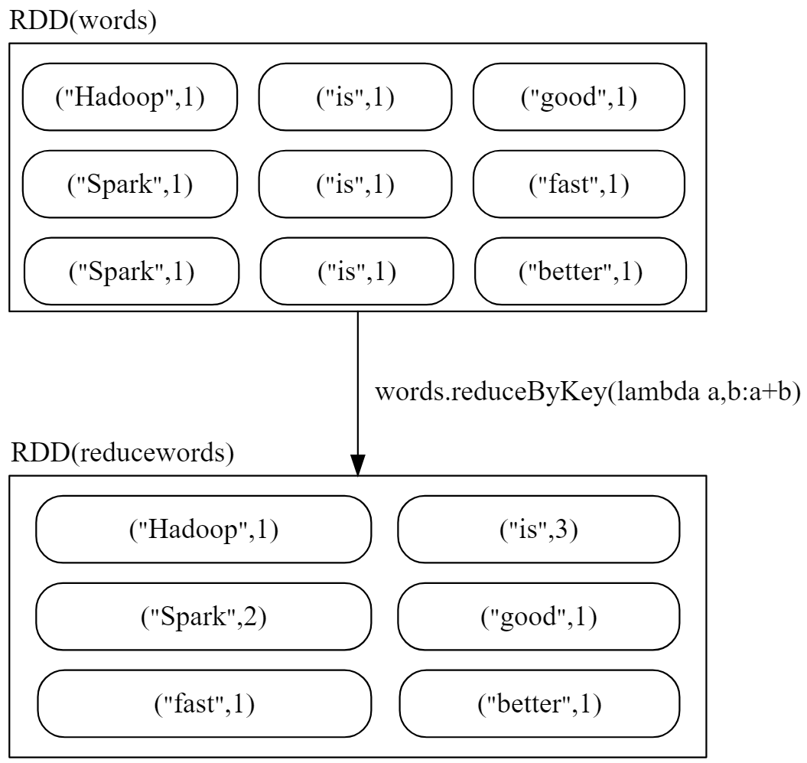

# RDD 行动操作

遇到行动操作才会发生真正的从头到尾巴的计算。

- count()，返回数据集中元素个数
- collect()，以列表形式返回数据集所有元素
- first()，返回数据集第一个元素
- take(n)，返回前 n 和元素
- reduce(func)，对数据集元素通过函数 func 进行聚合操作
- foreach(func)，将数据集的元素传到 func 中去执行


# 持久化

多次反复访问同一组数据，把重复访问的数据放到内存中，不消失，第二次使用不用重头到尾去计算。以下程序会导致两次生成 RDD，触发重头到位的计算：

```py
words = sc.parallelize(["a", "b", "c"])
print(words.count())
print(', '.join(words.collect()))
```

`.persist()` 标记为持久化，不是马上计算 RDD 并持久化，第一次行动操作才会真正持久化。持久化后的 RDD 保存在计算节点中的内存中，后面的行动操作可以持续使用。传递参数提供不同级别的持久化：

1. MEMORY_ONLY，RDD作为反序列化的对象存入 JVM 中，内存不足，替换页面，等价于 `.cache()`
2. MEMORY_AND_DISK，保存到内存和磁盘，优先内存，内存不够就保存到磁盘

不用这个 RDD 时，手动把持久化的 RDD 从内存中消除：`.unpersist()`。

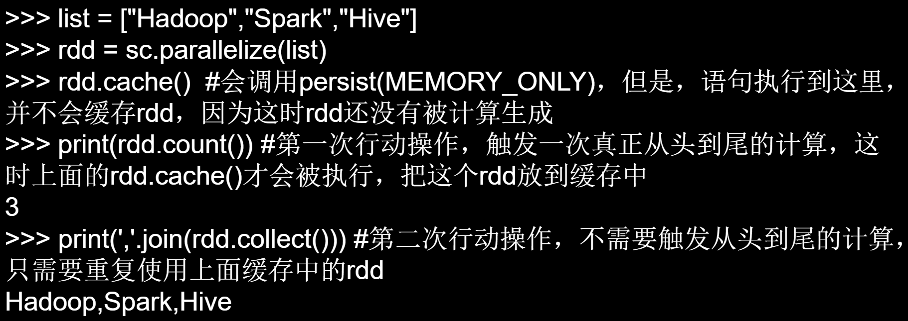

# 分区

RDD 本身是弹性分布式数据集，分区的用途：
1. 增加并行度，多个节点同时发生计算。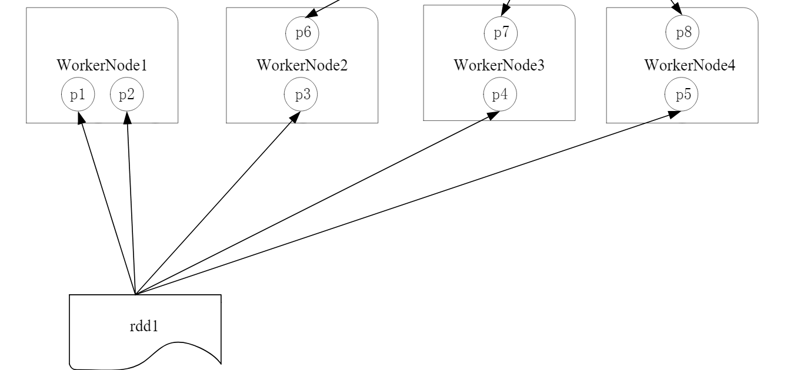
2. 减少通信开销。

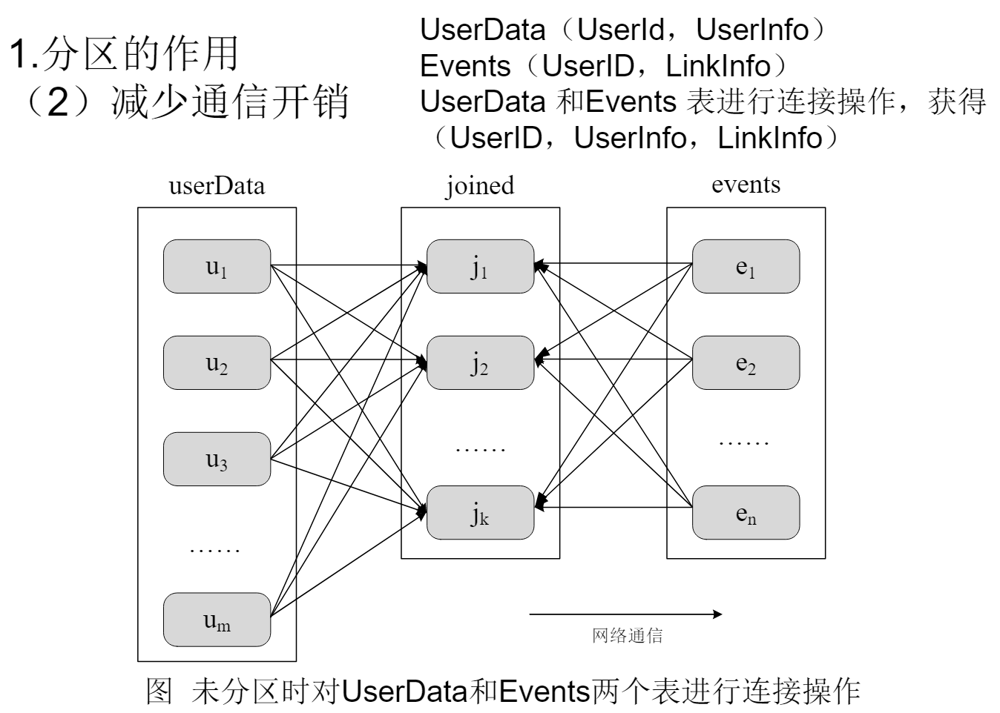
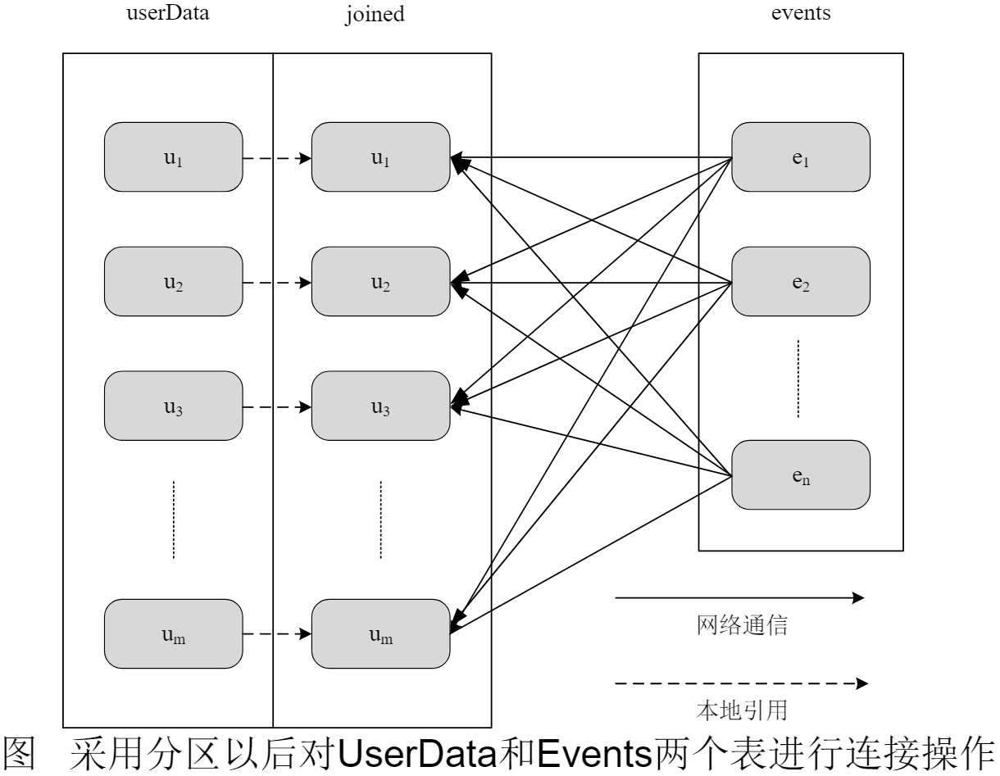

## 分区原则

分区个数尽可能等于集群中 CPU 核心的数目，一个分区启动一个线程。对不不同的部署模式而言，可以设置参数来配置默认的分区数目。
- local 模式，默认为 local[N] 个
- Mesos模式，默认分区数为 8
- standalone 和 YARN 模式，取 CPU 数目和 2 中的较大值作为分区数目

`sc.parallelize(list, 2)` 设置两个分区。
`len(rdd.glom().collect())` 显示分区数量。
`rdd1 = rdd.repartition(1)` 重新设置分区数量。

计算过程可以动态调整分区的个数，因此称为弹性分布数据集。如访问数据库时，减少对数据库频繁的读写开销，一般会减少分区数目。

## 分区方式

1. 哈系分区
2. 区域分区
3. 自定义分区

自定义分区，进一步减小通信开销。按照 key 值最后一位的数字，写到不同的文件。先自定义分区函数：

```py
def myPartition(key):
    # 指定要被分到的分区
    return key % 10

data = sc.parallelize(data, 5)
# 重分区
# partitionBy 只接受键值对类型，传入的参数有 key 在取出元素
data.map(lambda x: (x, 1)).partitionBy(10, myPartition).map(lambda x: x[0]).saveAsTextFile("foldername")
# 有 10 个分区，会写出到 10 个文件，所以要指定目录地址，而不是文件地址
```

# 综合实例

词频统计。

```py
words = sc.textFile("filename")
word_rdd = words.flatMap(lambda line: line.split(' ').map(lambda word: word, 1).reduceByKey(lambda a, b: a + b))
print(word_rdd.collect())
```

# 键值对 RDD

RDD 中的每一个元素都是键值对。如，从文件加载，然后 map 映射为键值对。常见操作：

1. reduceByKey(func)，先按照 key 进行分组，得到<键，值的列表>，按照 func 对值的列表进行操作。
2. groupByKey()，按照 key 进行分组，得到<键，值的列表(可迭代对象)>，不进行聚合计算。

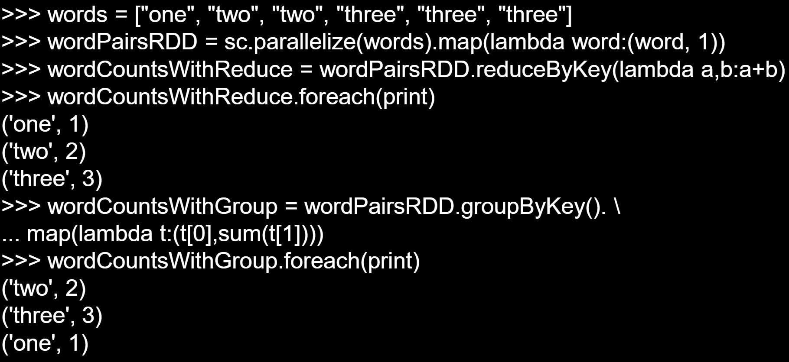

reduceByKey = groupByKey + map，第一个是传入的值的列表中的元素，第二个传入的是值的列表，所以可以直接 sum 求和。

3. keys，把所有的 key 返回形成一个新的 RDD
4. values，把所有的 value 取出来，返回新的 RDD
5. sortByKey，按照 key 进行排序，生成新的 RDD，(False) 表示降序
6. sortBy，`sortBy(lambda x: x[1], False)`，按照值排序
7. mapValues，key 不变，值映射为新的值，`mapValues(lambda x: x + 2)`
8. join，连接操作，键值对按照 key 相同的连接起来。

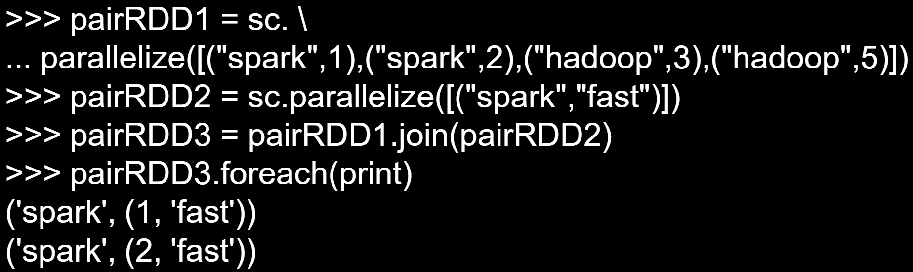

# 一个实例

key 表示图书名称，value 表示某天图书的销量，计算每种图书每天的平均销量。

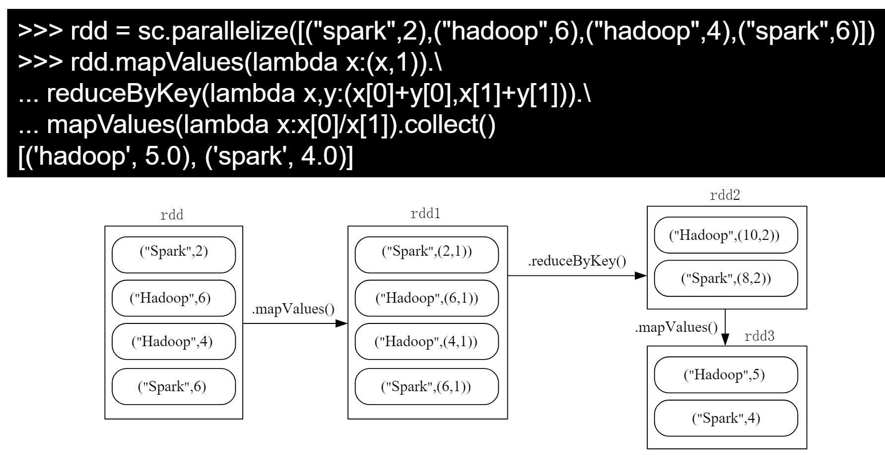

