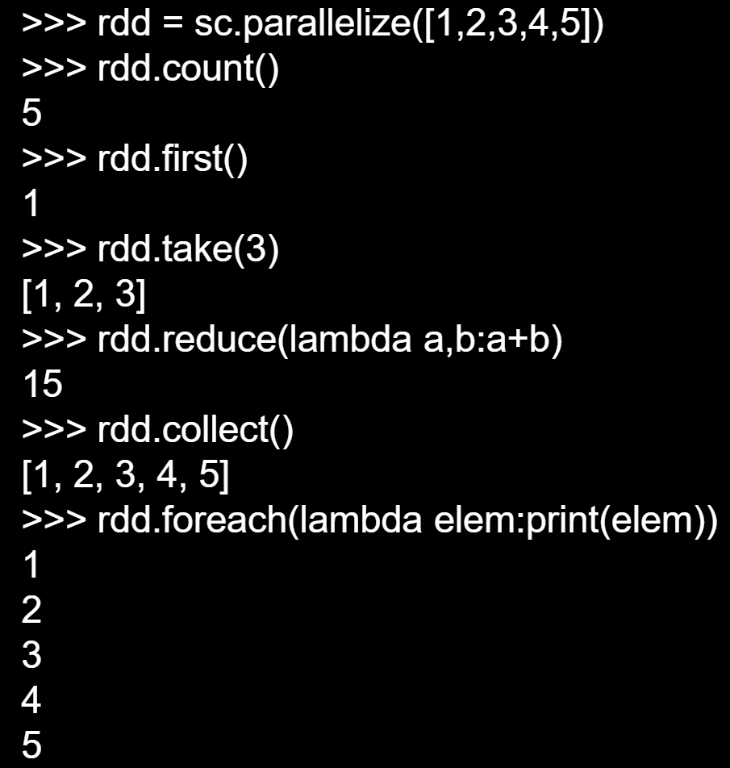

# RDD 创建

在 Spark core 核心上开发了其他组件，RDD 编程是在 Spark core 上进行的操作。可以通过从文件系统加载数据、集合数据创建 RDD。

1. 从文件系统加载数据创建 RDD，通过 SparkContext 的 `textFile()` 方法读取数据生成**内存中的 RDD**。支持加载的数据类型为：本地文件系统的文件，分布式文件系统 HDFS 中的文件，S3 存储的云文件等。pyshark 交互式环境会生成默认的 sparkcontext，写代码需要自己生成。 RDD 中的元素也是字符串，然后 `rdd.foreach(print)`，对 RDD 中的每个元素执行 print 函数。
2. parallelize 方法，对集合或列表并行化来创建 RDD。
    ```py
    ls = [1, 2, 3, 4, 5]
    rdd = sc.parallelize(ls)
    rdd.foreach(print)
    ```
    

# RDD 转换操作

RDD 创建之后不可修改，每次转换操作会生成新的 RDD，多次的转换操作会生成 DAG 图。而后提交 DAG 转换图，进行优化，stage，子任务，到 worker 节点。转换不会发生计算，只记录转换的轨迹，这是惰性机制。遇到行动类型的操作，才会发生计算。

- filter(func)：筛选出满足 func 要求的元素，结果返回一个新数据集。`lambda line: "s" in line`，前者是函数的输入参数，后者是函数体。包含，为 true 放到输出结果。遍历 RDD 中的每一个元素，执行 func 函数。

- map(func)：一对一映射，每个元素传入 func 函数，结果返回一个新数据集。遍历 RDD 中的每一个元素，执行 func 函数。

- flatmap(func)：输入元素可以被映射为0个或多个元素。

- groupByKey()：应用于键值对数据集，按键分组，值是一个列表。是一个可迭代的对象。rdd = [('a', 1), ..., ('a', 2)]。

- reduceByKey(func)：应用于键值对数据集，两部操作，先按照上面的内容生成归并好的列表，然后计算列表。返回 key 传入 func 函数进行聚合后的结果，计算的是按照 key 组合好的列表。

# RDD 行动操作

遇到行动操作才会发生真正的计算。

- count()，返回数据集中元素个数
- collect()，以列表形式返回数据集所有元素
- first()，返回数据集第一个元素
- take(n)，返回前 n 和元素
- reduce(func)，对数据集元素通过函数 func 进行聚合操作
- foreach(func)，将数据集的元素传到 func 中去执行



