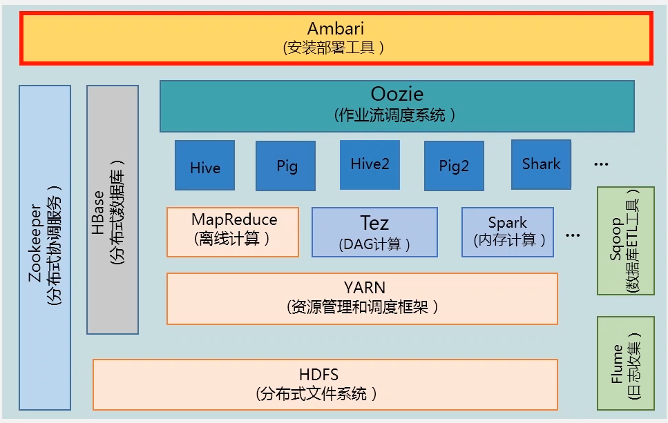
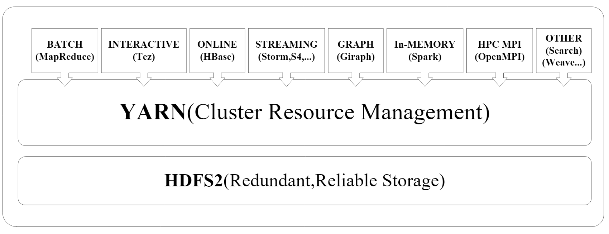
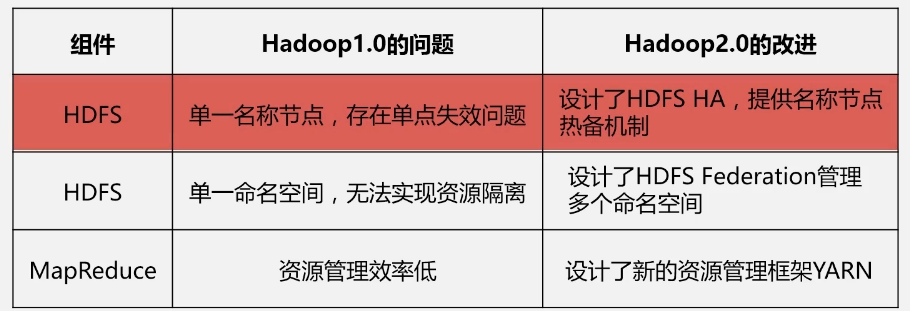
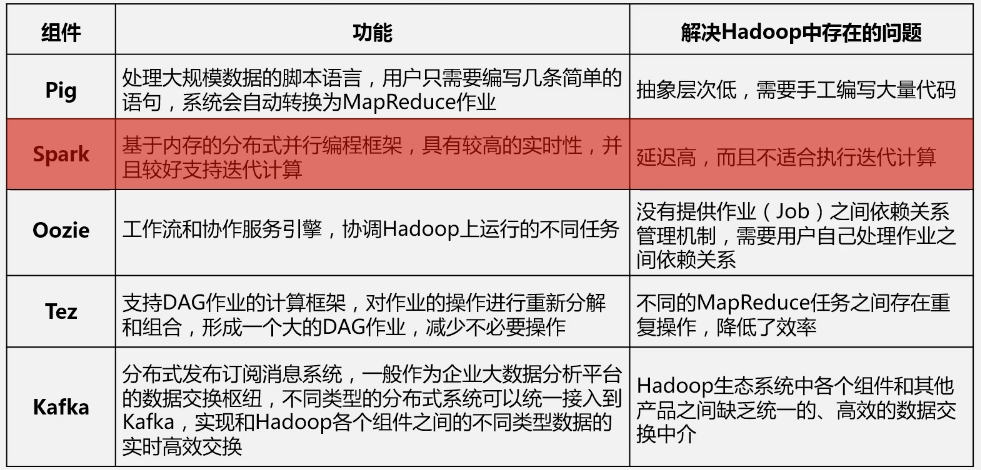

# hadoop

屏蔽了大数据计算的底层细节，java 开发所以跨平台比较好，支持多门语言。

1. 某一部分机器出现故障，剩余机器继续对外服务
2. 集群可以不断的扩展机器

不是单一的软件，是完整的生态系统。

1. 数据来源层
2. 大数据层，包括分布式文件存储和数据处理
3. 访问层，数据分析、数据实时查询、数据挖掘

---

- **HDFS**，应用广泛，如非结构化数据的存储，支持海量分布式文件存储
- YARN，分配CPU和内存等资源

离线数据分析：
- **MapReduce**，分布式计算
- Hive，存储数据与分析，如SQL。不存储数据，数据在HDFS，Hive只是编程接口，将SQL语句换成mapreduce计算语句，对HDFS存储的数据进行查询分析，返回结果
- Pig，数据流处理，清洗、转换和加载，和 Hive 组合使用，Hive查询数据时，Pig完成对数据的清洗

实时数据查询：
- HBase，实时计算

数据挖掘：
- Mahout，分布式数据挖掘机器学习常见算法等

---

- Ambari，自动安装、部署和配置集群
- zookeeper，分布式协调服务，如选择 master 节点等
- Sqoop，数据库抽取、转换、加载，将历史存储的关系性数据保存到HDFS中，进行大数据处理。将HDFS中的数据保存到SQL等关系性数据库中。
- flume，日志分析收集，高可用
- Oozie，任务流调度

版本问题：

1. hadoop 1.0，HDFS 和 mapreduce
2. hadoop 2.0，YARN，将资源调度和管理功能从 mapreduce 抽离出来，NN Federation，HA（高可用性）
3. 选择开源、稳定、经验、社区等

### YARN

Yet Another Resource Negotiator。企业中，不同的需求用不同的计算框架，将三种框架部署到1000台机器中，会产生资源争抢问题。有一个统一的资源调度管理框架，防止资源浪费、和资源竞争，方便数据无缝使用，YARN产生了。

# 集群的部署和使用

## hdfs

- 分布式文件系统包括两大核心节点，namenode，唯一，其它是 datanode。应用访问 namenode，获取数据存储在哪里，而后去访问数据。
- secondarynamenode，顶替坏掉的 namenode。

## mapreduce

- jobtracker，对用户作业管理，拆分成小作业，交给不同的机器去运行
- 不同机器上面安装 tasktracker，跟踪和执行分配给自己的作业

大部分节点用来做datanode和tasktracker，可以位于同一台机器，就处理位于这一台机器上的数据。磁盘、内存、CPU、带宽都要好的。

namenode 元数据保存到内存，超大内存，通道优化，网络更高，因为要交互。secondarynamenode 类似，最好是不同的机器上。

小的集群，jobtracker 可以和 namenode 位于同一台机器；大的集群，需要更多的内存，所以位于不同的机器。

## 局限与不足

- mapreduce 表达能力有限，迭代效率低
- 资源浪费，必须 map 完成后才能 reduce

