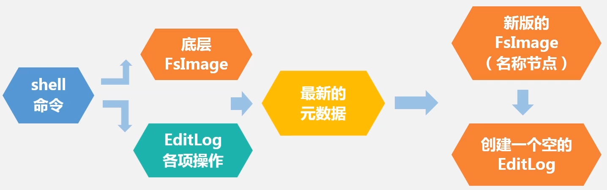
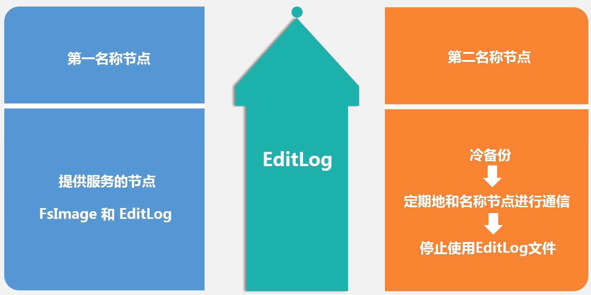
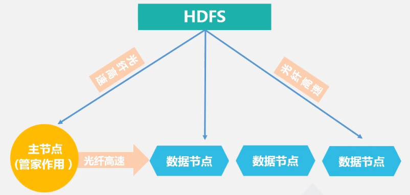
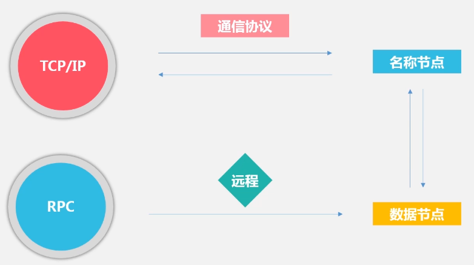
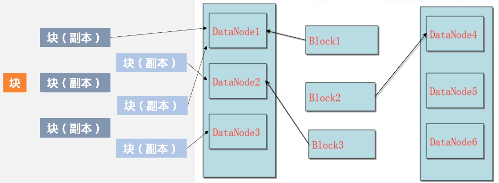
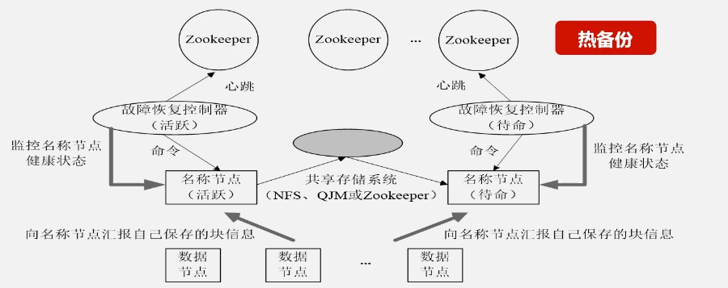
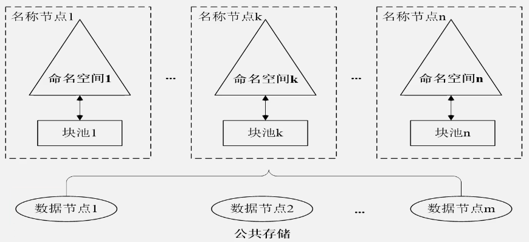

# hadoop distributed file system

解决海量数据的分布式存储问题，好多计算机去存储数据。主节点提供数据目录的服务，从节点存储数据。设计目标：

- 兼容廉价的硬件设备
- 实现流数据读写，大规模数据的批量处理
- 支持大数据集
- 支持简单的文件模型，允许高效读取数据，获取批量处理的特性，可以追加，不能修改
- 支持跨平台

自身局限性：

- 不适合低延迟的数据访问，一次读取大规模数据，不是一次读一条，实时性不高
- 没有办法高效存储大量小文件。将大数据切分放到不同的 datanode 节点，而 namenode 节点存储索引等元信息。文件特别多，元信息会很大，占用内存
- 不支持多用户写入以及修改文件

## 相关概念

块是最核心的概念，如进程隔离，降低寻址开销等。但比普通文件系统的块要大很多，支持大规模数据的存储，降低分布式节点的寻址开销。但如果块过大，mapreduce 一两个任务就会牺牲并行读，发挥不了并行处理的优势。

1. 支持大规模文件存储，分布式存储可以突破单机存储的上限
2. 简化系统设计，块的大小是固定的，方便元数据的计算
3. 适合数据备份，以块为单位进行存储和冗余备份

namenode：主节点，HDFS 的关键，负责元数据（文件类型，文件被分成多少块，每个块和文件的关系，每个块被存储到哪个节点）的存储，记录数据存在哪里。

- fsImage：存储相关元数据，保存系统文件树，了解系统目录的文件是什么样子。文件的复制等级、修改和访问的时间、访问权限、块的大小和组成文件的块，不包括块位于哪个节点。数据节点和名称节点在运行过程中实时维护这些信息，数据节点向名称节点汇报当前节点保存了哪些数据块，名称节点更新数据结构。名称节点启动时，处理这俩数据结构的流程以及 editlog 的作用：

- editLog：记录对数据进行的创建、删除、重命名等操作。fsImage 规模很大，每次修改都要修改 fsImage 会很慢，更新的部分放到 editlog，提升操作效率。但 editlog 会不断增大。此时需要 secondarynode，secondarynode 两个作用，对名称节点的冷备份，对 editlog 的处理。

名称节点停止写入 editlog 后，创建 edits.new ，新来的需求写入这里。第二名称节点获取 editlog 和 fsimage，做合并操作修改数据得到新的 fsimage，发送给名称节点。名称节点把 edits.new 更改为 editlog。实现了文件修改的记录，也实现了冷备份。

datanode：存取实际数据，各自机器的数据保存到本地的 linux 文件系统中。

## 体系结构

主从架构。主节点是管家作用，提供数据目录服务，其它都是数据节点。

- 读：应用先访问主节点，获取元数据信息，知道要访问的数据位于哪台机器，然后去访问。
- 写：应用访问主节点，主节点告诉应用，数据分为多少块，这个块位于A节点，这个块位于B节点，应用去存储。

### 命名空间

目录/文件/块，通信协议（基于TCP/IP）：

### 局限

1. 命名空间限制，名称节点的元信息位于内存，能容纳的块的数量是有限的
2. 性能瓶颈：分布式文件的吞吐量，受到单个名称节点吞吐量的限制
3. 隔离问题：集群只有一个名称节点，只有一个命名空间，无法对多个应用程序进行隔离
4. 可用性：单点故障问题。第二名称节点是冷备份，不能保证名称节点故障就立刻替换，然后继续工作。必须是，名称节点故障后，必须停止一段时间，第二节点恢复 fsimage 后，继续对外服务

## 存储原理

### 数据冗余保存

集群较为廉价，会不断的出故障，所以数据必须冗余，一个数据块默认被保存为 3 份。伪分布式（名称节点和数据节点位于同一台机器），此时的冗余只能是1。
- 加快数据访问速度，因为可能有三个应用访问一个数据，就可以访问冗余数据
- 检查数据错误，检查其中有没有出错
- 数据可靠性，如果一个副本出错，立刻恢复一个副本

### 数据存放策略

此时来了一个块，创建三个副本。

- 第一副本：如果数据存储的发起方位于数据节点，就存到当前数据节点；如果发起方是外部应用，随机挑一个 CPU 不太忙，磁盘不太慢的机器存储
- 第二副本：选择另外的机架
- 第三副本：放在和第一个副本相同机架的不同节点上
- 第四第五第六等副本，随机放

数据读取，就近读取，开销小。hdfs 有 API 可以计算数据节点所属的机架的 ID，获取客户端的 ID 和 那些数据所属的 ID，如果相同，读取当前 ID 的，如果不同，随机选择一个副本读取。

### 错误和恢复

1. 名称节点出错，导致 hdfs 无法访问，方案是冷备份
2. 数据节点出错，数据节点运行期间给名称节点发送心跳信息，表示自己还能用；收不到表示不能用，标记当前机器为宕机。因为其它节点都有备份，所以可以立刻恢复。也可以调整冗余数据的位置，一个机器很忙，另一个机器佷闲。
3. 数据出错，如磁盘损坏。读取数据时使用校验码验证数据是否出错，如果错了，就冗余复制和恢复。

# 改进

## HA

HDFS HA，一旦故障，待命的立刻到活跃状态；数据节点同时向『待命』节点也发送数据信息，fsimage 保证一致。活跃节点向共享存储系统写入 editlog，待命节点取走 editlog，保证 editlog 实时一致。

## Federation

- 不可以水平扩展，名称节点只有一个，不能通过纵向扩展（加内存）来解决问题。
- 系统的整体性能受到单个名称节点的吞吐量限制，热备份只是备份，不提供服务。
- 难以提供不同程序之间的隔离性，一个程序过大，占用了大部分资源。

多个名称节点，相互独立，共享底层的数据公共存储区域。名称节点管理自己的命名空间，数据块构成块池，块池是逻辑概念，最终的数据仍然位于底层的存储区域。挂载不同的命名空间去访问子空间的数据。解决了单名称节点存在的问题。

- 可扩展性强，每个名称节点管理自己的数据，扩展到更多节点，更多元数据，不受内存限制
- 性能高效，同时对外提供服务
- 隔离性好，不同的数据在不同的名称节点，对不同应用程序进行隔离，防止一个程序资源占用过大，占用其它程序

每个名称节点都配一个热备份节点。