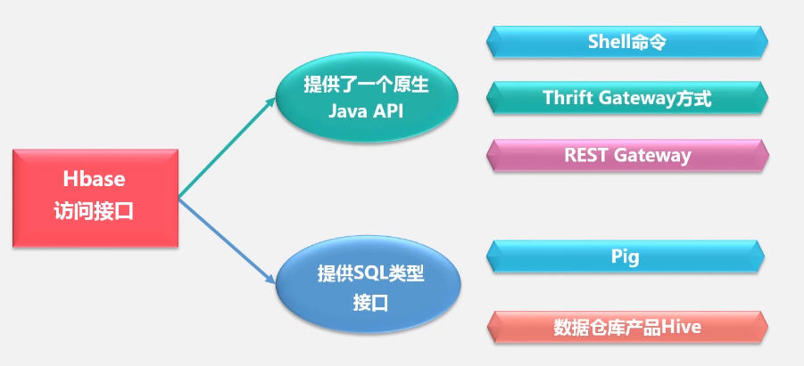
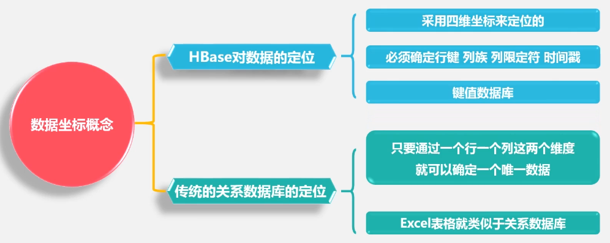
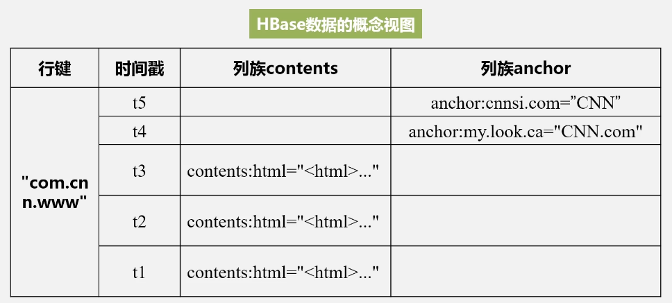
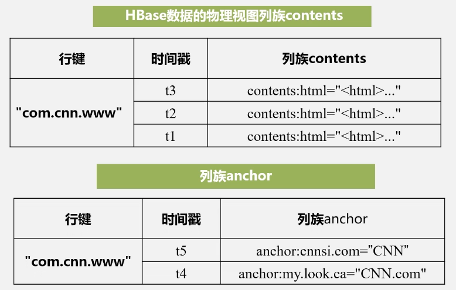
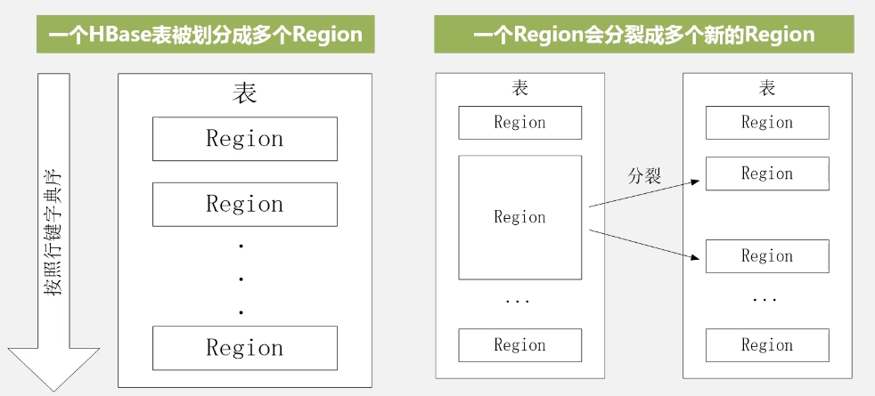
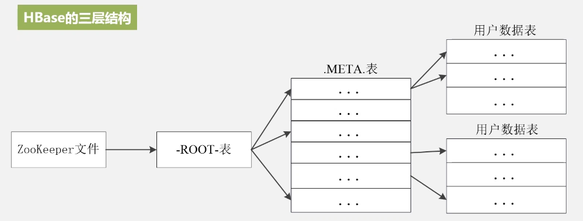
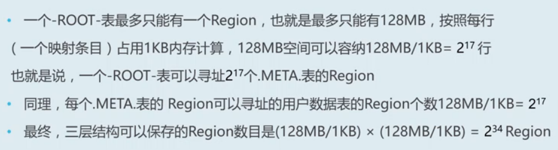
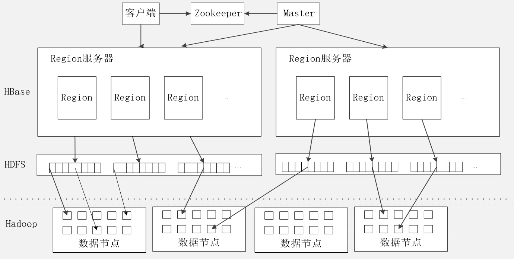
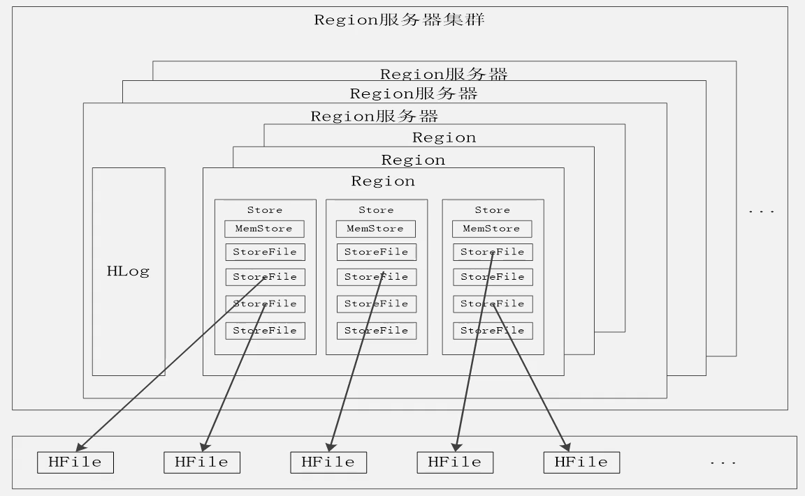
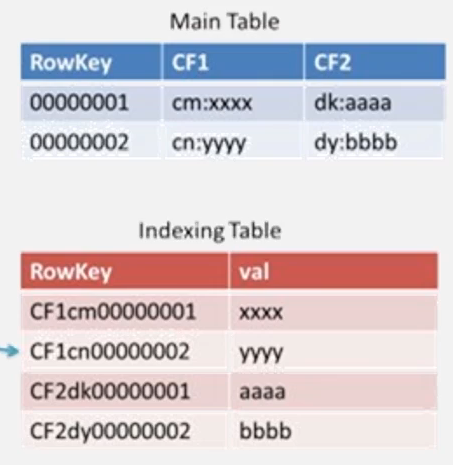

# 分布式数据库 HBase

是 bigtable 的开源实现，bigtable 最初满足互联网搜索引擎的基本请求，建表与查询，并不是直接存在磁盘上。

- 性能好，支持大规模数据的存储，支持分布式存储。

HBase 是一种分布式数据库，基于 HDFS，通过 hadoop mapreduce 操作数据，zookeeper 完成协同管理服务。存储结构化和半结构化的松散数据，通过水平扩展的方式，用几千台机器存储数据。

HDFS 可以存储数据，为什么要 HBase？
- 满足实时处理的需求
- 关系型数据库解决不了大规模数据的存储问题。数据规模扩大时，主从结构分流读负载；分库；分表；人工操作不便，效率低，数据的结构经常变化，维护需要停机。HBase 后台自动切分，实现水平可扩展性。

## 与关系数据库的联系和区别

- 数据类型方面，关系型数据库就是传统经典类型；HBase 是字节，如何解析取决于程序员
- 数据操作，关系型数据库增删改查，多表连接；HBase 没有多表连接
- 存储模式，关系数据库行存储，HBase 列存储
- 索引方面，关系数据库有很多的复杂索引，满足查询需求；
- 数据维护，关系数据库修改数据；HBase 追加数据，后期自动清理旧数据
- 可伸缩性，关系数据库很难水平扩展，纵向扩展受到天花板的制约；HBase 多台数据，可以自由水平扩展

## 数据模型

HBase 是一个稀疏的多维度的排序映射表，索引定位：行键、列族、列限定符和时间戳，每一个值都是未经解释的字节。一行可以有一个行键和任意多个列。

列族支持动态扩展，增加和减少列。

数据更新保留旧版本的原因（与 hdfs 有关）：hdfs 只允许写入追加，不允许修改，所以 HBase 也不行。

以表的形式去组织数据，不考虑数据库范式等，追求效率而不是空间，如避免多表连接查询。表由若干行和列组成，列包括很多列族（基本单元），行就是行键。通过行键、列族和列限定符确定唯一的单元格（具体存储数据的地方）。通过时间戳区分新的版本的数据。所以用四个维度定位数据。

### 概念视图

稀疏的表，冒号后面的是列限定符。

底层物理存储时，以列族为单位进行存储，时间戳和列族拿出来，单独进行存储。

### 存储结构

关系型数据库以行为主，存完一行存下一行。HBase 以列为单位进行存储。

- 行存储：对于传统的事务性操作，每次插入数据，如购物数据，会方便一些；分析数据时，取出列数据困难，比如分析购物人群的年龄分布，需要遍历全部数据库。
- 列存储：数据类型相似，带来很高的压缩率；以分析型为主，就列存储。

## 实现原理

核心功能组件：库函数（链接每个客户端，客户端利用库函数去访问数据）、master服务器（关键，HBase 分区信息维护和管理，维护 region 服务器列表与分配负载均衡）、region 服务器（存储不同的 region，以及和客户端的数据读写）。

表过大，里面的 region 开始分裂，分裂快速。分裂并不是先物理分裂，只是修改指向信息，数据仍然在旧的 region 中，保证快速拆分。最终后台会将拆分信息写入到新的文件，而后通知 master，后来的服务就读取新的文件。

region 大概可以 1GB 左右，不同的 region 位于不同的服务器，同一个 region 绝对不会被拆分到不同的服务器。

### region 定位

三层结构寻址和定位。元数据表两列，第一列是 region 的 ID，第二列是 region 位于服务器的 ID，称为 META 表；META 表太大也需要分裂。但 root 表不允许分裂。

- zookeeper，记录 root 表的位置信息
- root表记录 meta 表的位置信息（只有一个
- meta表，记录用户数据的 region 信息（可以有多个

可以满足企业的存储需求：

为了加速寻址，设有缓存机制。

## 运行机制

- 客户端，访问 hbase 的接口，自己的缓存维护已经访问过的 region 的信息
- zookeeper，协同管理服务，管家功能，维护和管理整个 HBase 集群
- master，表和 region 的管理，如增删该查；维护 region 的负载均衡，如把常访问的 region 分一部分到负载轻的服务器。负责调整分裂、合并后 region 的分布，重新分配故障的 region 服务器。
- region 服务器，存储好多 region，共用一个 HLog，对 region 的列族进行切分形成 store，sotrefile 借助 hdfs 来存储。

### 读写输入

- 写数据，分配到 region 服务器去执行，先写入缓存（memstore）；为了保证数据的安全和可恢复性，要写入 HLog 日志。在 HLog 当中的数据被完整写入磁盘，返回返回客户端。
- 读数据，region 服务器先访问 memstore，找不到，再去 storefile 找。

### 缓存刷新

- 系统周期性的把 memstore 缓存里的内容写入磁盘中的 storefile 中，清空缓存，并在 HLog 中写入一个标记。
- 每次刷写都会生成一个新的 storefile 文件，每个 store 包含多个 storefile。
- 每个 region 服务器有自己的 HLog。每次启动检查文件，确认最近一次执行是否发生新的写入操作，如果写入，memstore->storefile，删除旧的 HLog，而后为用户提供服务。

### storefile 的合并

每次刷写都会生成新的 storefile，影响查找速度。文件数量超过阈值，合并成一个大的 storefile。合并很大后，region 又需要分裂。

### HLog 工作原理

HBase 是分布式数据库，底层是廉价的低端机。难免出现故障，通过日志来恢复数据。写入日志，而后写入 memstore 缓存，memstore 写完后，才能写入缓存。

zookeeper 监控是否有机器出现问题。如果有，通知 master，master 获取损坏机器的日志。分隔出每个 region 的日志，进行数据恢复。共用一个 HLog 的原因是：写入时方便。

## HBase 应用方案

- 性能优化方法：时间戳作为行键，降序排列，可以访问最近读写的数据；实时性高，相关数据放入缓存提升读写性能，但不能所有数据进缓存；设置最大版本数，不用保存没用的版本，节省空间；时间过期后自动清空数据。
- 性能检测：master-status，ganglia；openTSDB；Ambari。
- SQL 语句查询 HBase 中的数据：易使用，减少代码量。如 Hive，Phoenix。
- 构建 HBase 二级索引，默认不支持对列构建索引，只支持对行键构建索引。如行键访问数据，行键的起始点和终止点访问区间数据，全表扫描。coprocessor 新特性构建二级索引。更新插入操作，触发，插入的数据同步写入数据索引表，HBase 有主表和索引表（二级索引，对列索引）。非侵入性，不需要修改 HBase；但每次插入数据，都需要更新索引表，耗时翻倍。索引表在磁盘，会佷耗时。可以考虑 redis 等数据库，索引写入内存的 redis，而后不忙了写入磁盘。

