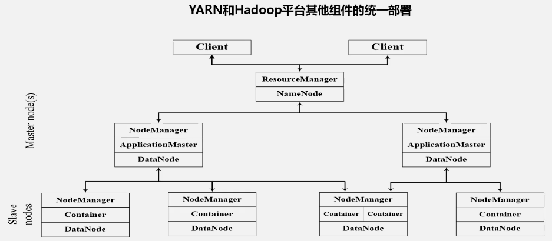

- 单点故障，无法继续计算
- 任务过重，计算和资源分配连接在一起
- 内存溢出，按任务划分，不按需求划分
- 资源划分不合理，reduce 的机器空闲，map 的机器很忙

# YARN

将资源管理调度从计算任务中分隔出来，不在负责计算。

- resourcemanager，处理客户端请求，启动 applicationmaster，监控 nodemanager，资源分配与调度
- applicationmaster，任务调度、监控与恢复。启动任务，任务在不同节点运行，监控节点的运行信息，任务出错，需要恢复。
- nodemanager，单个节点上的资源管理，处理来自 resourcemanager 和 applicationmaster 的命令，任务的启动与停止。

## RM

全局资源管理器，负责整个系统的资源管理和分配，包括两个组件，调度器（scheduler）和应用程序管理器（applications manager），调度器接受来自 applicationmaster 的请求，将资源以容器的形式提供给申请的应用。容器选择考虑应用程序所要处理的数据的位置，就近分配，计算向数据靠拢。容器：动态资源分配单位，包含了一定数量的 CPU、内存和磁盘，限定应用可以使用的资源量。

applications manager，负责系统中所有应用程序的管理工作，包括应用程序的提交、与调度器协商资源以启动 applicationmaster，监控 applicationmaster 运行状态并在失败时重启。

## applicationmaster

RM 接受用户提交的作业，按照作业的上下文信息以及 nodemanager 收集的容器状态信息，启动调度进程，为作业分配 applicationmaster。运行在容器中。先给 applicationmaster 分配容器。

1. 用户作业提交时，applicationmaster 和 RM 协商获取资源，RM 以容器的形式给 applicationmaster 分配资源
2. 将获取的资源进行二次分配，如 map 与 reduce
3. 与 nodemanager 保持通信，在 nodemanager 容器中启动 map 等任务，启动、运行、监控和停止。监控申请到的资源，对任务进度进行监控，任务失败时恢复。
4. 定时向 RM 发送心跳信息，报告自己资源的使用情况和作业进度信息。最后反馈个用户，用户通过 RM 进行查询。
5. 执行完后，向 RM 申请注销容器。发生故障，重新向 RM 申请资源，再次启动。

## nodemanager

驻留在 YARN 集群中每个节点上的代理，管理抽象的容器，处理与容器相关事宜。任务状态的管理归楼上管，自己只汇报每个容器上任务的执行信息。

1. 容器生命周期管理，容器里具体运行任务
2. 监控每个容器的 CPU、内存等资源的使用情况，跟踪节点的健康状况，是否宕机等
3. 上述通信内容
4. 接受 applicationmaster 的停止、启动容器等各种请求

## YARN 的工作流程

1. 用户编写客户端程序，向 YARN 提交，包括 applicationmaster 程序，用户程序，启动 applicationmaster 命令
2. RM 接受和处理客户端的请求，为应用程序分配容器，容器中启动 applicationmaster，applicationmaster 总管作业调度和执行
3. applicationmaster 启动后，向 RM 注册，RM 才能实时监控和管理 applicationmaster，applicationmaster 才能向 RM 不断汇报
4. applicationmaster 轮询的方式向 RM 申请资源，作业执行，分配多个子任务如 map reduce，每个任务都需要容器资源
5. RM 以容器的形式向提出申请的 applicationmaster 分配资源，对资源二次分配给子任务
6. applicationmaster 为容器设置好运行环境、包、启动命令等；在容器中启动脚本。
7. 每个任务向 applicationmaster 汇总自己的状态和进度。每个节点驻留一个 nodemanager，监控这些容器，将容器的进展、信息反馈给 applicationmaster。失败，重启恢复。
8. 程序结束后，applicationmaster 向 RM 管理器注销，关闭自己，释放容器资源。