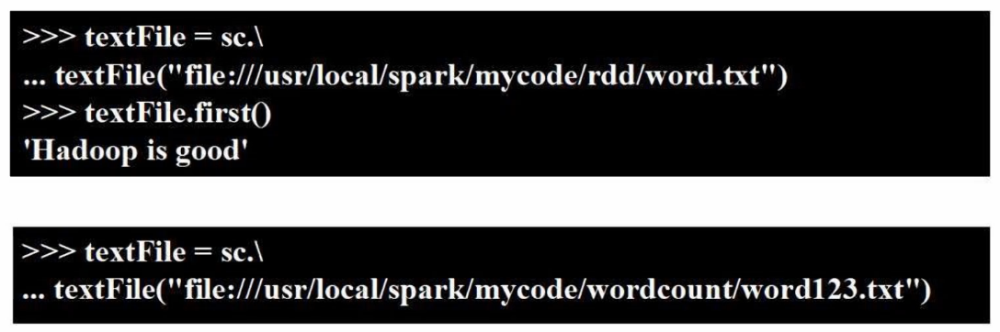
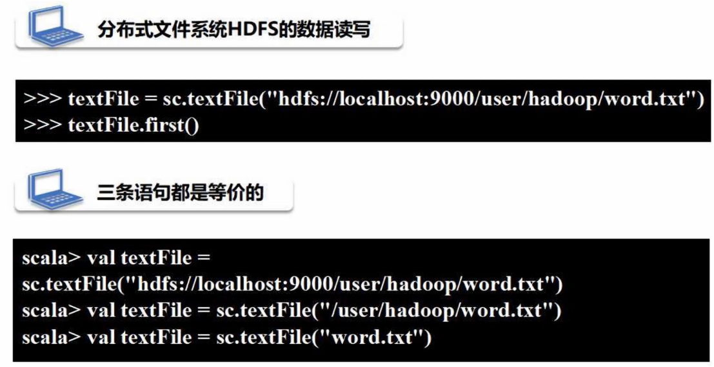
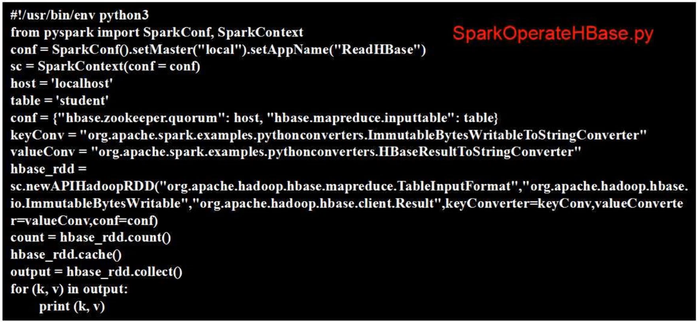
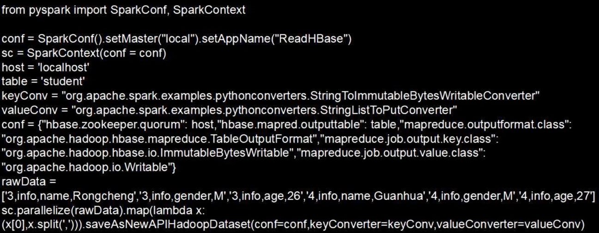
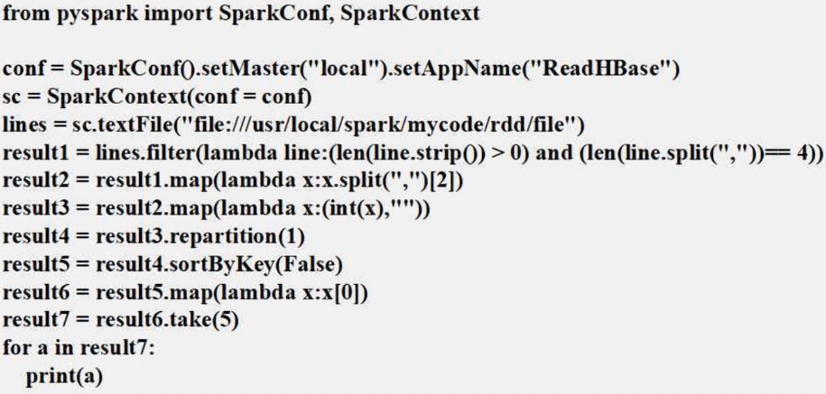
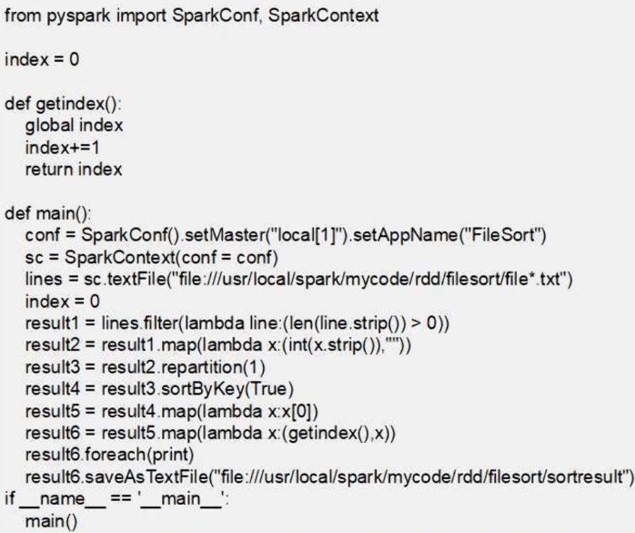

# 普通文件数据读写

除非遇到行动类型操作，否则惰性机制不会加载文件，即使文件路径是错的，也不会报错。



写入文本文件时，`sc.saveAsTextFile('path)`，注意，写入文件只指定目录，不需要指定文件名。分布式环境下因为有多个分区，多个分区就会有多个文件。想要再次读时，读取路径，而不是读文件。多个文件读到一个 RDD 中。

## 读取 hdfs 文件



保存时，仍然保存至路径。

# 读写 HBase

HBase 是分布式数据库，数据被保存到 hdfs 中，架构在 hdfs 之上。稀疏多维度排序的映射表。行键唯一标识一行。关系数据库按行存储，HBase 按单元格存储。hdfs 只读，HBase 数据修改只能追加，以最新时间戳访问数据。

概念视图：


存储：

行键、列族、时间戳为单位进行存储。水平按行分割，竖直按列分割，每个分区被保存到不同的节点中。

## 创建 hbase 表

1. 启动 hadoop
2. 启动 hbase
3. 启动 hbase 的 shell 环境

```spark
disable 'student' # 令 student 表失效
drop 'student' # 删除 student 表
create 'student', 'info' # 创建 student 表，info 列族
# 按单元格插入
put 'student', '1', 'info:name', 'lanling' 
put 'student', '1', 'info:gender', 'F'
put 'student', '1', 'info:age', '23'
scan 'student' # 查看表
```

## 配置 spark

## 读取 HBase 数据

有 API 将表的内容以 RDD 的形式加载到 Spark 中。`keyConv`，将数据库 HBase 的格式转换为字符串格式。localhost 是 zookeeper 的地址，也就是本地。



## 写入 HBase



# 案例

## 求 top 值



## 文件排序

